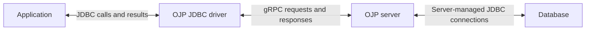

# Open J Proxy


[](https://github.com/Open-J-Proxy/ojp/actions/workflows/main.yml)
[](https://github.com/Open-J-Proxy/ojp-framework-integration/actions/workflows/main.yml)
[](https://raw.githubusercontent.com/Open-J-Proxy/ojp/master/LICENSE)

[](https://www.meterian.com/report/gh/Open-J-Proxy/ojp)
[](https://www.meterian.com/report/gh/Open-J-Proxy/ojp)

---

<a id="📘-free-open-j-proxy-ebook"></a>
## 📘 Free Open J Proxy eBook

Learn how Open J Proxy works, how to deploy it, and how to use it in production.

**[Download the free Open J Proxy eBook →](https://openjproxy.com/register-to-ojp-email-list.html)**

---

**Community:** [Website](https://openjproxy.com) · [LinkedIn](https://www.linkedin.com/company/open-j-proxy) · [Discord](https://discord.gg/J5DdHpaUzu)

---

**A smart, open-source database control plane** — delivered as a Type 3 JDBC driver, early language-native clients, and a Layer 7 proxy server. OJP sits between your applications and your relational databases and provides backpressure, rich observability, client-side reactive throttling, slow-vs-fast query segregation, and load balancing / failover.

<a id="overview"></a>
## System picture

This component map shows who communicates with whom, **not the sequence of a query**. The server owns the real database connections; applications use the OJP JDBC driver.


<a id="value-proposition"></a>
OJP helps elastic applications avoid connection storms, gives operators visibility into database pressure, and supports load-aware routing and optional slow/fast query segregation. See the [problem and solution](documents/targeted-problem/README.md) for context.

### Choose your next step

You do not need to understand OJP's implementation to use it. Choose the information that helps you make a decision or complete your task:

<a id="further-documents"></a>
| I want to… | Start here |
|---|---|
| Evaluate OJP — managers and architects | [Problem and solution](documents/targeted-problem/README.md) · [Introduction and suitability](documents/ebook/part1-chapter1-introduction.md) · [Support policy](SUPPORT.md) |
| Try OJP | [Quick start below](#quick-start) · [Full walkthrough](documents/ebook/part1-chapter3-quickstart.md) |
| Integrate an application | [Framework guides](documents/java-frameworks/README.md) |
| Deploy and operate OJP — ops teams and DBAs | [Docker](documents/configuration/DOCKER_DEPLOYMENT.md) · [Runnable JAR](documents/runnable-jar/README.md) · [Production guide](documents/monitoring/PRODUCTION_DEPLOYMENT_GUIDE.md) · [Telemetry](documents/telemetry/README.md) |
| Look up settings | [JDBC reference](documents/configuration/ojp-jdbc-configuration.md) · [Server reference](documents/configuration/ojp-server-configuration.md) |
| Configure high availability | [Multinode guide](documents/multinode/README.md) |
| Understand behaviour or contribute | [Optional flow diagrams](documents/designs/MAIN_FLOWS.md) · [Contributing](CONTRIBUTING.md) |
| Browse all documentation | [Documentation hub](documents/README.md) · [Ebook reading paths](documents/ebook/README.md#reading-paths) |

## Requirements

- **OJP JDBC Driver**: Java 11 or higher
- **OJP Server**: Java 25 or higher
- **Tested through JDBC**: PostgreSQL, MySQL, MariaDB, Oracle, SQL Server, DB2, and H2.
- **Early non-Java clients** currently target single-endpoint H2 L1; they are not JDBC-feature-equivalent or production-ready. See [clients and tested coverage](documents/README.md#multi-language-clients).

## Quick Start

This Docker example runs from a cloned repository on a Linux host with an existing database accessible to the server.

> **Disable application-level connection pooling** (including HikariCP). OJP manages backend pools on the server. [Framework guides](documents/java-frameworks/README.md) explain integration and runtime dependencies.

### 1. Start OJP Server (Docker)

> **JDBC drivers are not bundled.** Download and mount them; proprietary drivers require separate installation. See [external drivers and libraries](documents/configuration/DRIVERS_AND_LIBS.md).

```bash
# Download drivers first
mkdir -p ojp-libs
cd ojp-server
bash download-drivers.sh ../ojp-libs
cd ..

# Run with drivers mounted
docker run --rm -d \
  --network host \
  -v "$(pwd)/ojp-libs:/opt/ojp/ojp-libs" \
  -e JAVA_TOOL_OPTIONS="-Duser.timezone=UTC" \
  rrobetti/ojp:1.0.0
```

### 2. Add OJP JDBC Driver to your project
```xml
<dependency>
    <groupId>org.openjproxy</groupId>
    <artifactId>ojp-jdbc-driver</artifactId>
    <version>1.0.0</version>
</dependency>
```

### 3. Update your JDBC URL
Replace your existing connection URL by prefixing with `ojp[host:port]_`:

```java
// Before (PostgreSQL example)
"jdbc:postgresql://localhost:5432/mydb"

// After
"jdbc:ojp[localhost:1059]_postgresql://localhost:5432/mydb"
```
Use the ojp driver: `org.openjproxy.jdbc.Driver`

Supply database credentials through your application's secure configuration. For a full walkthrough and first query, see the [Quick Start Guide](documents/ebook/part1-chapter3-quickstart.md).

<a id="alternative-setup-executable-jar-no-docker"></a>
Without Docker, use the [Executable JAR Setup Guide](documents/runnable-jar/README.md); always start the server with `-Duser.timezone=UTC`.

## Documentation

Choose a task or audience in the [documentation hub](documents/README.md), or follow the [ebook reading paths](documents/ebook/README.md#reading-paths) for a longer explanation.

## Understand what happens

If you want to explore runtime behaviour, start with [executeQuery](documents/designs/EXECUTE_QUERY_FLOW.md), or choose an operation in the **[Simplified Flow Diagrams](documents/designs/MAIN_FLOWS.md)**. These are optional explanations, not prerequisites for evaluation, deployment, or use. Follow notes and source checkpoints only when your question needs that detail.

<a id="mixed-oltp--olap-workloads--enable-slow-query-segregation"></a>
<a id="mixed-oltp--olap-workloads-enable-slow-query-segregation"></a>
For mixed OLTP/OLAP workloads, see [Slow Query Segregation](documents/designs/SLOW_QUERY_SEGREGATION.md); it is disabled by default. The SQL enhancer is experimental, disabled by default, and not recommended for production.

<a id="contributing--developer-guide"></a>
To contribute, start with [CONTRIBUTING.md](CONTRIBUTING.md) and [source setup and testing](documents/code-contributions/setup_and_testing_ojp_source.md).

## Project information

<a id="vision"></a>
<a id="roadmap"></a>
[Roadmap and vision](ROADMAP.md) · [Support policy](SUPPORT.md) · [Releases](https://github.com/Open-J-Proxy/ojp/releases) · [License](LICENSE) · [Contributor recognition](documents/contributor-badges/contributor-recognition-program.md)

## Partners

| Logo                                                                                                                                                                                                                        | Description                                                                                                                                | Website |
|-----------------------------------------------------------------------------------------------------------------------------------------------------------------------------------------------------------------------------|--------------------------------------------------------------------------------------------------------------------------------------------|---------|
| <a href="https://www.linkedin.com/in/devsjava/" target="_blank" rel="noopener"></a>                       | Brazilian Java User Group connecting developers for knowledge sharing and professional networking.                                         | [linkedin.com/in/devsjava](https://www.linkedin.com/in/devsjava/) |
| <a href="https://github.com/switcherapi" target="_blank" rel="noopener"></a> | Feature management platform for managing features at scale with performance focus.                                                         | [github.com/switcherapi](https://github.com/switcherapi) |
| <a href="https://www.meterian.io/" target="_blank" rel="noopener"></a>                                               | Application security platform that identifies vulnerabilities across open-source dependencies and application code.                        | [meterian.io](https://www.meterian.io/) |
| <a href="https://www.youtube.com/@cbrjar" target="_blank" rel="noopener"></a>                                                                | YouTube channel for Java developers covering frameworks, containers, and modern JVM topics.                                                | [youtube.com/@cbrjar](https://www.youtube.com/@cbrjar) |
| <a href="https://javachallengers.com/career-diagnosis" target="_blank" rel="noopener"></a>                                   | Helps developers go beyond coding, mastering Java fundamentals, building career confidence, and preparing for international opportunities. | [javachallengers.com](https://javachallengers.com/career-diagnosis) |
| <a href="https://omnifish.ee" target="_blank" rel="noopener"></a>                                                                             | The team behind Eclipse GlassFish, delivering reliable opensource solutions with enterprise support.                                       | [omnifish.ee](https://omnifish.ee/) |
