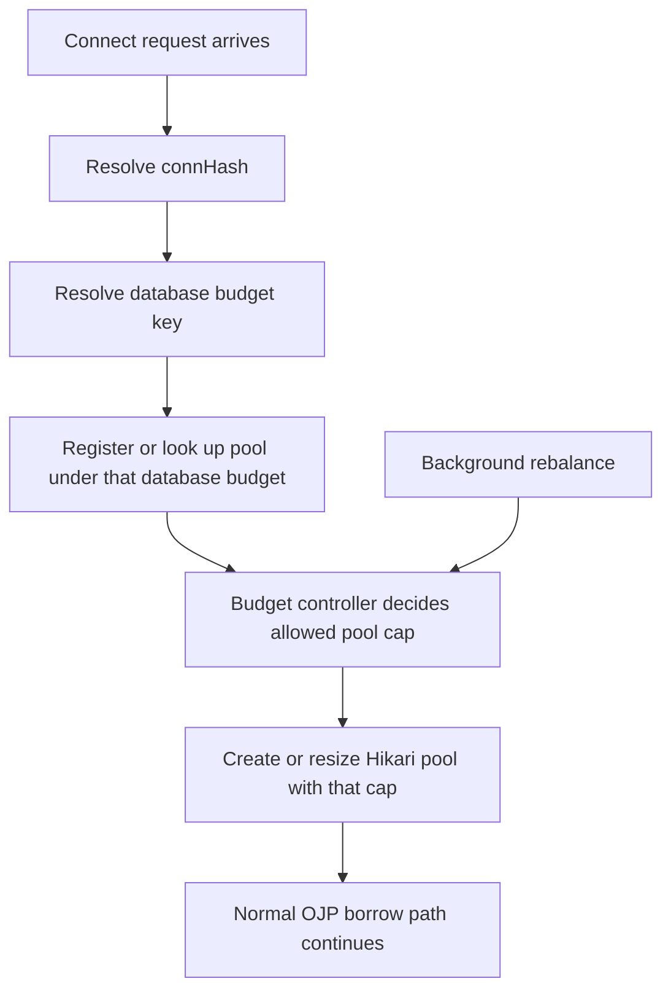
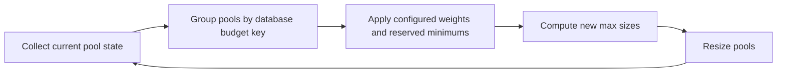

# OJP Server Total Database Connection Budget - Detailed Design Analysis

**Date:** September 27, 2026  
**Status:** 📋 **Design Proposal**  
**Scope:** OJP server-side control of the total number of physical database
connections across multiple pools targeting the same real database, while
avoiding additional hot-path queues or semaphores

---

## Executive Summary

This document analyzes how OJP Server can enforce a **single total connection
budget per real database** even when OJP creates multiple separate pools for
that same target.

The key problem is that OJP currently protects **each pool independently**, but
multiple pools can still oversubscribe one physical database when their maximum
sizes are summed together.

**Recommendation:** enforce the total at the **pool budget layer**, not at the
request-time borrow path.

More specifically:

1. Group multiple pools under a shared **database budget key**
2. Give that key one **hard total connection budget**
3. Split that budget across pools using configured **weights/priorities**
4. Resize pools in the background as demand changes
5. Keep request-time behavior fail-fast and avoid adding another blocking gate

**Recommended first implementation:**

- support **priority by database username** first
- treat **client-name priority** as a later classification/budgeting feature
- keep **cluster-wide enforcement** as a separate follow-up concern

This direction fits OJP's current architecture much better than adding another
shared request-time semaphore or queue in front of pooled connection borrowing.

---

## Table of Contents

1. [Problem Statement](#1-problem-statement)
2. [Current-State Observations](#2-current-state-observations)
3. [Design Goals](#3-design-goals)
4. [Why an Extra Hot-Path Gate Is a Poor Fit](#4-why-an-extra-hot-path-gate-is-a-poor-fit)
5. [Recommended Model: Database Budget Controller](#5-recommended-model-database-budget-controller)
6. [Database Budget Key Options](#6-database-budget-key-options)
7. [Pool-Level Allocation Model](#7-pool-level-allocation-model)
8. [Priority by Database Username](#8-priority-by-database-username)
9. [Priority by Client Name](#9-priority-by-client-name)
10. [Suggested Server Configuration Shape](#10-suggested-server-configuration-shape)
11. [Strictness vs Elasticity Tradeoff](#11-strictness-vs-elasticity-tradeoff)
12. [Multi-Node Concerns](#12-multi-node-concerns)
13. [Phased Rollout Recommendation](#13-phased-rollout-recommendation)
14. [Risks and Mitigations](#14-risks-and-mitigations)
15. [Open Questions](#15-open-questions)
16. [Final Recommendation](#16-final-recommendation)

---

## 1. Problem Statement

The goal is to answer this question:

> How can OJP Server guarantee that the **total number of physical database
> connections** to one real database does not exceed a configured limit, even
> when OJP creates multiple pools against that same target?

Additional constraints from the request:

- avoid adding new queues in the hot path
- avoid adding new semaphores in the hot path
- allow higher priority for some clients
- priority may be based on **client name** or **database username**
- configuration should live on **OJP Server**

This is intentionally an **analysis/design-only** document, not an
implementation task.

---

## 2. Current-State Observations

### 2.1 What OJP Already Does Well

OJP already has strong **per-pool** protection:

- each datasource/pool gets its own `AdmissionControlManager`
- each datasource/pool gets its own `SlotManager`
- connection acquisition fails fast when the pool is exhausted
- slow-query segregation can isolate fast and slow workloads inside one pool

These mechanisms are good at protecting a single pool from overload.

### 2.2 The Missing Protection

The missing protection is **database-wide**, not **pool-wide**.

OJP pool identity is based on a connection hash that includes:

- JDBC URL
- database username
- password
- datasource name

That means one real database can end up with multiple separate pools.

### 2.3 Why This Matters

Example:

- Real database safe limit: **80**
- Pool A max: **40**
- Pool B max: **30**
- Pool C max: **30**

Each pool looks valid by itself, but together they can reach **100**.

So the current model can protect each pool individually while still allowing
the real database to be oversubscribed.

### 2.4 Architecture Fit Observation

This feature is not primarily about SQL execution fairness. It is mainly about
**capacity budgeting across multiple pools**. That strongly suggests the
solution should live near:

- datasource identity
- pool creation
- pool sizing
- runtime resizing

and not in the per-request statement execution path.

---

## 3. Design Goals

### 3.1 Functional Goals

- Enforce a single total OJP-managed connection budget per real database
- Support multiple pools under that one budget
- Allow higher-priority consumers to receive a larger share of the budget
- Support server-side configuration of the budgeting rules

### 3.2 Non-Functional Goals

- Avoid introducing another blocking queue in the hot path
- Avoid introducing another shared semaphore in the hot path
- Keep the request/borrow path simple and fast
- Reuse current OJP pool-management patterns where possible
- Keep the model understandable for operators

---

## 4. Why an Extra Hot-Path Gate Is a Poor Fit

One obvious idea would be:

> add a second shared gate in front of `DataSource.getConnection()` so that all
> pools targeting the same database compete for one global permit set

This is not the recommended direction.

### 4.1 Problems with a Shared Request-Time Gate

- adds more contention to the hottest path
- increases waiting behavior
- risks worse tail latency
- introduces another concurrency structure to debug and tune
- overlaps awkwardly with the existing per-pool admission controls

### 4.2 Operational Drawback

This would shift a pool-sizing problem into a request-time coordination problem.
That is usually the more expensive place to solve it.

### 4.3 Design Conclusion

The better fit is:

- decide total allowed capacity **before or outside** request execution
- apply that decision by controlling **pool maxima**
- keep request-time behavior mostly unchanged

---

## 5. Recommended Model: Database Budget Controller

Introduce a new OJP Server concept:

- **database budget key**

This key represents the real database target being protected.

Multiple pools may map to the same database budget key.

Each key gets:

- one total connection budget
- optional reserve/headroom
- priority weights
- optional borrowing rules

### 5.1 Core Model

1. A connection request arrives
2. OJP resolves the normal pool identity (`connHash`)
3. OJP also resolves a **database budget key**
4. The pool registers under that budget key
5. A budget controller decides the pool's allowed maximum
6. OJP creates or resizes the pool using that maximum

### 5.2 High-Level Flow



### 5.3 Why This Fits OJP Better

- OJP already creates pools centrally on the server
- OJP already manages pool sizes and runtime resizing
- OJP already uses fail-fast admission behavior inside each pool
- this model avoids adding another cross-pool wait path

---

## 6. Database Budget Key Options

This is one of the most important design choices.

OJP needs a stable way to say:

> "these different pools all count against the same real database budget"

### 6.1 Option A - Explicit Server-Side Group Name

Examples:

- `orders-prod`
- `reporting-prod`

**Pros:**

- very clear for operators
- no JDBC parsing ambiguity
- easy to document and reason about

**Cons:**

- needs explicit configuration

### 6.2 Option B - Normalized JDBC Target

Example normalization inputs:

- database type
- host
- port
- database name / service / SID

**Pros:**

- more automatic

**Cons:**

- different databases need different parsing rules
- aliases, proxies, VIPs, and URL options may hide true identity
- risk of grouping incorrectly

### 6.3 Option C - Hybrid

- use explicit server-side group name when configured
- fall back to normalized JDBC target otherwise

### 6.4 Recommendation

The best fit is a **hybrid approach**, but the explicit server-side group should
be the recommended production path because it is the least ambiguous.

---

## 7. Pool-Level Allocation Model

Once pools are grouped under one database budget key, OJP can allocate portions
of the total budget to individual pools.

### 7.1 Simple Example

Database budget:

- `orders-prod` total budget = **60**

Pools:

- Pool A = `app_rw`
- Pool B = `reporting_ro`
- Pool C = `etl_user`

Possible allocation:

- Pool A gets **40**
- Pool B gets **10**
- Pool C gets **10**

Then OJP creates or resizes the pools to those limits.

### 7.2 Rebalance Example

If Pool B is mostly idle later, the budget controller may rebalance:

- Pool A = **45**
- Pool B = **5**
- Pool C = **10**

Still total = **60**

### 7.3 Background Rebalance Loop



This loop can run:

- on pool creation
- on pool shutdown
- on config reload
- on a short periodic timer

This keeps allocation logic mostly off the hot path.

### 7.4 Suggested Allocation Inputs

The budget controller should support:

1. hard total budget per database
2. optional reserved headroom
3. weights per username or client class
4. minimum floor per class
5. maximum ceiling per class
6. optional borrowing of unused capacity

---

## 8. Priority by Database Username

This is the cleanest first implementation.

### 8.1 Why It Fits Well

- username is already available at connection time
- username already affects pool identity
- username-based pools are easy to reason about operationally

### 8.2 Example

Total budget = **60**

Weights:

- `app_rw` = 4
- `reporting_ro` = 1

Allocation:

- `app_rw` gets about **48**
- `reporting_ro` gets about **12**

### 8.3 Recommendation

If OJP wants a first implementation with good value and lower risk,
**priority by database username should come first**.

It aligns naturally with current OJP pool identity behavior and does not require
fine-grained per-request fairness logic.

---

## 9. Priority by Client Name

This is more complex than username-based priority.

### 9.1 Why It Is Harder

Today OJP tracks `clientUUID` for counting connected clients, but that is not
the same as a stable business-level client name such as:

- `payments-service`
- `reporting-service`
- `etl-runner`

Also, multiple client names may share one pool.

If high-priority and low-priority clients share the same pool, pool sizing alone
cannot guarantee that the high-priority client gets better request-time
treatment.

### 9.2 Two Main Approaches

#### Approach A - Separate Pool Classes by Client Classification

Examples:

- payments traffic goes to one logical pool class
- reporting traffic goes to another

**Pros:**

- keeps most fairness at the budgeting layer
- avoids more request-time coordination

**Cons:**

- may increase the number of pools

#### Approach B - One Shared Pool with Request-Time Priority Scheduling

**Pros:**

- more precise fairness

**Cons:**

- pushes more logic into the hot path
- likely requires shared request-time coordination
- higher performance risk

### 9.3 Recommendation

If client-name priority is required, OJP should first treat it as a
**classification input for budgeting/grouping**, not as a per-request scheduling
problem.

In simple terms:

> prefer "different client classes get different budgeted pool slices" over
> "all requests compete in one smart global priority queue"

---

## 10. Suggested Server Configuration Shape

Below is an example of the kind of configuration OJP Server could expose:

```properties
# Database budget group
ojp.server.databaseBudgets.ordersProd.match.jdbcUrlPattern=jdbc:postgresql://db1:5432/orders
ojp.server.databaseBudgets.ordersProd.maxTotalConnections=80
ojp.server.databaseBudgets.ordersProd.reserveConnections=10

# Priority by database username
ojp.server.databaseBudgets.ordersProd.priorities.username.app_rw.weight=5
ojp.server.databaseBudgets.ordersProd.priorities.username.reporting_ro.weight=1
ojp.server.databaseBudgets.ordersProd.priorities.username.etl_user.weight=2

# Optional future client-class priority
ojp.server.databaseBudgets.ordersProd.priorities.clientClass.payments.weight=5
ojp.server.databaseBudgets.ordersProd.priorities.clientClass.reporting.weight=1

# Rebalancing
ojp.server.databaseBudgets.ordersProd.rebalanceIntervalMs=5000
ojp.server.databaseBudgets.ordersProd.allowBorrowing=true
```

This is only an example shape, not a final property naming decision.

---

## 11. Strictness vs Elasticity Tradeoff

This area needs to be called out clearly.

### 11.1 Strict Safety Goal

To keep OJP within the configured database budget, the sum of the configured
pool maxima should stay within that budget.

That is the core enforcement mechanism.

### 11.2 Runtime Reality

Shrinking a live pool is not instantaneous.

If a pool is currently using many active connections, lowering its configured
maximum:

- stops future growth quickly
- does not instantly terminate active work
- allows the pool to shrink as connections become idle

### 11.3 Practical Conclusion

This model is:

- strict at the **configured-capacity** level
- eventually consistent at the **live active-usage** level during rebalance

That is still a much better operational position than having multiple
independent pools with no shared total budget.

---

## 12. Multi-Node Concerns

This is one of the largest open concerns.

If several OJP Server nodes connect to the same real database:

- each node can control its own local pools
- local-only control does **not** guarantee a cluster-wide total

### 12.1 Example

- Node A allows **40**
- Node B allows **40**
- real database target is **60**

Combined, they can still reach **80**.

### 12.2 Main Options

#### Option A - Static Per-Node Split

Example:

- global target = 60
- 3 nodes
- each node receives 20

**Pros:**

- simple

**Cons:**

- wastes capacity when load is uneven

#### Option B - Shared Distributed Budget State

Examples:

- lease/reservation model
- central coordinator
- shared consensus-backed state

**Pros:**

- stronger cluster-wide control

**Cons:**

- significantly more complex
- introduces extra coordination and failure modes

### 12.3 Recommendation

Phase this concern separately:

1. support **single-node/local enforcement** first
2. add **cluster-wide coordination** only if required by deployment needs

---

## 13. Phased Rollout Recommendation

### Phase 1 - Server-Side Database Budgeting

- add database budget grouping
- add hard total budget per database group
- allocate pool maxima from that budget
- support priority by **database username**
- rebalance in the background

### Phase 2 - Client Classification

- add optional **client name / client class** input
- use it for budgeting/grouping
- prefer separate pool classes or slices over request-time priority scheduling

### Phase 3 - Cluster-Wide Enforcement

- shared state across OJP nodes
- lease/reservation model or another distributed coordination approach

---

## 14. Risks and Mitigations

| Risk | Impact | Mitigation |
|---|---|---|
| Budget key groups unrelated databases together | Wrong capacity enforcement | Prefer explicit server-side group names in production |
| Budget key fails to group equivalent targets | Oversubscription remains possible | Support explicit grouping and document it as preferred |
| Rebalance reacts too slowly | Temporary imbalance | Rebalance on pool create/close plus periodic timer |
| Rebalance reacts too aggressively | Pool churn and operator confusion | Use minimum floors, ceilings, and damped resize rules |
| Client-name priority increases pool count too much | Operational complexity | Start with username priority; add client classes only where justified |
| Local-only enforcement in multi-node setup gives false confidence | Cluster oversubscription | Document the scope clearly and treat cluster-wide control as a separate phase |

---

## 15. Open Questions

These questions should be answered before implementation:

1. Does the limit need to be strict for:
   - one OJP node only, or
   - all OJP nodes combined?

2. How should OJP identify "same database"?
   - explicit server-side budget group
   - normalized JDBC target
   - both

3. What exactly should "client name" mean?
   - application name
   - datasource name
   - service name
   - another explicit client-class property

4. Is fast rejection acceptable for low-priority traffic?

5. Should unused low-priority capacity be borrowable by higher-priority classes?

6. Does OJP need reserved headroom for:
   - admin sessions
   - migrations
   - non-OJP consumers

7. Is eventual consistency during live rebalancing acceptable?

---

## 16. Final Recommendation

The recommended direction is:

1. implement **database budget control on OJP Server**
2. enforce the total budget by **controlling pool sizes**
3. **do not** add another hot-path queue or semaphore
4. support **database username priority first**
5. treat **client-name priority** as a later classification/budgeting feature
6. handle **cluster-wide enforcement** as a separate follow-up concern

In simple language:

> keep the borrow path fast  
> move the intelligence to pool sizing and background rebalancing  
> start with username-based priority because it fits current OJP behavior better

### Confidence

**Confidence:** High (about 85%)

Reasoning:

- the approach fits OJP's current per-pool architecture well
- it directly addresses the oversubscription gap
- it respects the requirement to avoid extra hot-path coordination
- the largest unknowns are around product choices and multi-node scope, not
  basic feasibility

