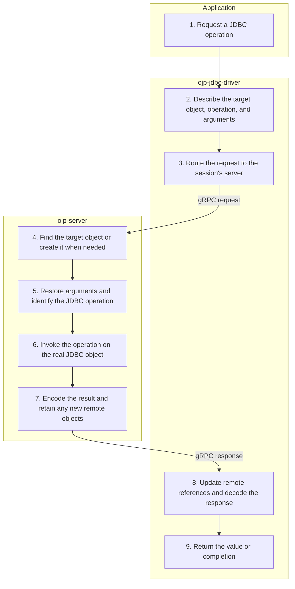

# Call Proxy — Simplified Flow Diagram

An application uses a JDBC operation that needs access to a server-side object, such as reading metadata, setting a statement option, or closing a cursor. This successful path ends when the driver returns the value or completion to the application.

## Essential notes

- **2–4:** This is a shared delegation path, not automatic retry after every error. Connection, statement, result, and LOB operations use it when they cannot be handled locally or by a dedicated request.
- **4:** Connection and statement calls can create a session and borrow a connection lazily, subject to admission capacity. Cursor and LOB calls normally resolve an existing remote object.
- **6:** The real database JDBC driver handles the operation; not every call needs database network traffic. Nested calls, such as reading a metadata property, can run within one request.
- **7–9:** Values cross the wire directly when supported; remote objects can be registered and represented by identifiers. The driver keeps returned session/object references for later calls. Server SQL errors are reported as JDBC exceptions.

## Go deeper

- How does remote cursor work fit into a query? Follow [executeQuery](EXECUTE_QUERY_FLOW.md).
- What crosses the wire? See [serialization details](../protobuf-nonjava-serializations.md) and the [client protocol specification](../multi-language-client-spec/CLIENT_SPEC.md).
- How does routing preserve a session? See the [multinode guide](../multinode/README.md).

## Source checkpoints

- [Connection request/response handling](../../ojp-jdbc-driver/src/main/java/org/openjproxy/jdbc/Connection.java), [statement handling](../../ojp-jdbc-driver/src/main/java/org/openjproxy/jdbc/Statement.java), and [remote cursor calls](../../ojp-jdbc-driver/src/main/java/org/openjproxy/jdbc/RemoteProxyResultSet.java).
- [Routing and session binding](../../ojp-jdbc-driver/src/main/java/org/openjproxy/grpc/client/MultinodeStatementService.java) and [server object resolution and invocation](../../ojp-server/src/main/java/org/openjproxy/grpc/server/action/resource/CallResourceAction.java).

See [Simplified Flow Diagrams](MAIN_FLOWS.md) for the conventions and other main flows.
