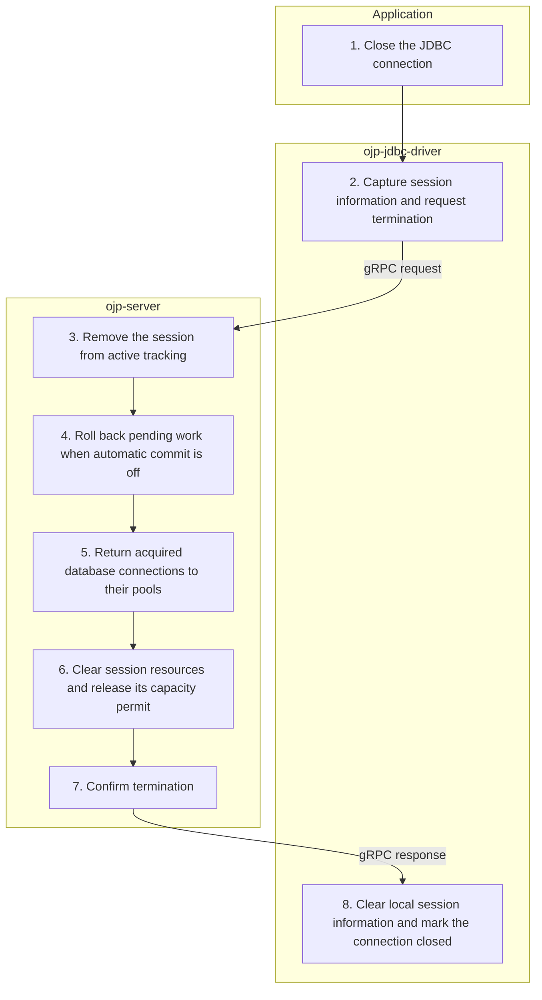

# Close connection — Simplified Flow Diagram

An application closes a regular, non-XA OJP connection. This successful path shows termination of an existing session and release of its server-side resources.

## Essential notes

- **2, 8:** Closure is asynchronous by default: the driver schedules termination and marks the connection closed **before** server cleanup finishes. The diagram's response order describes synchronous closure; asynchronous closure runs steps 3–7 in the background.
- **3:** If no session was created, or it has already ended, server termination has no session resources to release.
- **4–6:** Cleanup uses the physical connection's automatic-commit state to decide rollback. Acquired replica connections are closed before the primary. Pooled connection closure returns them for reuse; unpooled connections are physically closed.
- **5–8:** The shared server pools and gRPC channels stay open for other connections. Closing only a statement or result through [Call Proxy](CALL_PROXY_FLOW.md) does not perform this session cleanup. See [XA connection closure](XA_CLOSE_FLOW.md) for the separate XA pooling lifecycle.

## Go deeper

- Which settings affect closing? See [connection close behaviour](../configuration/ojp-jdbc-configuration.md#connection-close-behavior).
- How are abandoned sessions cleaned up? See [server session cleanup](../configuration/SESSION_CLEANUP.md).
- How does XA differ? Follow [XA connection closure](XA_CLOSE_FLOW.md).

## Source checkpoints

- [Driver synchronous/asynchronous closure](../../ojp-jdbc-driver/src/main/java/org/openjproxy/jdbc/Connection.java) and [termination routing](../../ojp-jdbc-driver/src/main/java/org/openjproxy/grpc/client/MultinodeStatementService.java).
- [Server termination request](../../ojp-server/src/main/java/org/openjproxy/grpc/server/action/session/TerminateSessionAction.java), [session removal and safety rollback](../../ojp-server/src/main/java/org/openjproxy/grpc/server/SessionManagerImpl.java), and [connection and permit release](../../ojp-server/src/main/java/org/openjproxy/grpc/server/Session.java).

See [Simplified Flow Diagrams](MAIN_FLOWS.md) for the conventions and other main flows.
