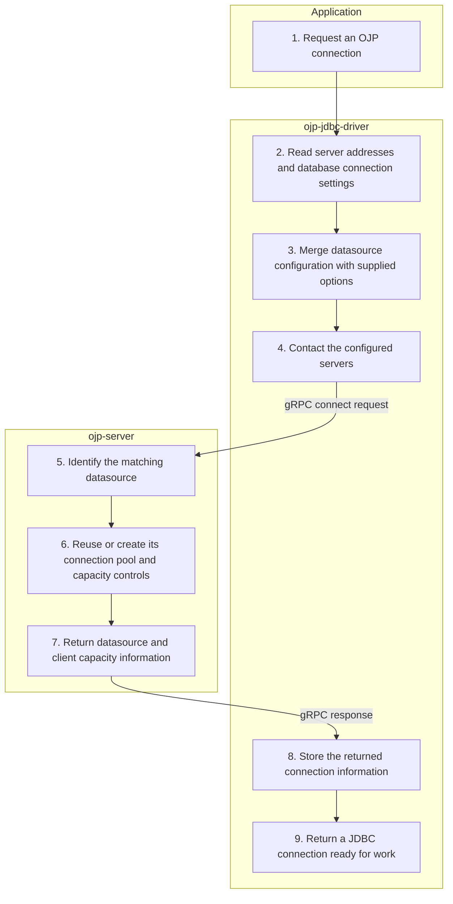

# Connect — Simplified Flow Diagram

An application requests a regular, non-XA OJP connection whose datasource identity is not yet cached by the driver. This successful pooled path ends with a JDBC connection ready to send work, not a dedicated database session.

## Essential notes

- **3:** Supplied `ojp.*` options override file-based defaults forwarded to the server.
- **4:** The driver uses the same routing infrastructure for one or several endpoints. In multinode mode it attempts connection setup on the configured servers; an available server is sufficient to proceed. Later connects with a cached datasource identity can skip the server request and build connection information locally.
- **5–6:** Pool identity includes database URL, credentials, and datasource name. Repeated connects reuse the matching pool; pool initialization may open physical database connections.
- **7–9:** The returned information has no session identifier yet. Later SQL, transaction, or [Call Proxy](CALL_PROXY_FLOW.md) work creates a session or borrows a temporary connection as needed. Unpooled mode records connection settings instead of creating a pool; see [XA connection setup](XA_CONNECT_FLOW.md) for the separate XA lifecycle.

## Go deeper

- How do I connect an application? See [framework integration](../java-frameworks/README.md) and the [JDBC configuration reference](../configuration/ojp-jdbc-configuration.md).
- What happens when SQL starts? Follow [executeQuery](EXECUTE_QUERY_FLOW.md) or [executeUpdate](EXECUTE_UPDATE_FLOW.md).
- How are pools managed? See the [pool provider overview](../connection-pool/README.md). For distributed transactions, start with [XA connection setup](XA_CONNECT_FLOW.md).

## Source checkpoints

- [URL, options, and JDBC connection creation](../../ojp-jdbc-driver/src/main/java/org/openjproxy/jdbc/Driver.java) and [multinode connection setup and identity caching](../../ojp-jdbc-driver/src/main/java/org/openjproxy/grpc/client/MultinodeConnectionManager.java).
- [Datasource setup and lazy session response](../../ojp-server/src/main/java/org/openjproxy/grpc/server/action/connection/ConnectAction.java) and [pool identity](../../ojp-server/src/main/java/org/openjproxy/grpc/server/utils/ConnectionHashGenerator.java).

See [Simplified Flow Diagrams](MAIN_FLOWS.md) for the conventions and other main flows.
