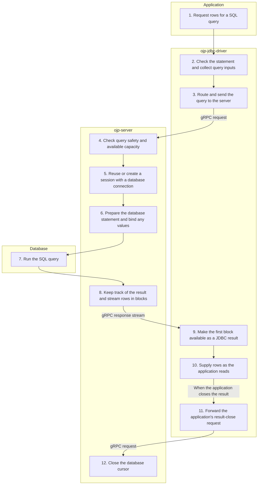

# executeQuery — Simplified Flow Diagram

An application requests rows through a statement or prepared statement on an already-open OJP connection. This successful path covers normal forward-only reading through result closure, using a server-managed pool, without query caching, read replicas, or SQL enhancement.

## Essential notes

- **2–3:** Configured client throttling can reject work before sending it. Routing respects an existing session's server affinity.
- **4–5:** Safety includes the query circuit breaker. New pooled sessions wait for admission capacity before borrowing a connection; an existing session can already hold its permit and connection.
- **8–10:** The server streams blocks while the application reads; it need not finish sending all rows before the query call returns. The driver consumes later blocks from the **same stream**, not a new fetch request for each block. `ojp.resultset.rowsPerBlock` controls block size; JDBC fetch size is only a hint here.
- **8–10, exceptions:** SQL Server / DB2 results containing certain LOB or binary types use one-row-at-a-time requests. Some result operations switch to remote cursor access. These paths are not drawn.
- **11–12:** Closing the result closes its database cursor, **not the OJP connection/session**. Close statements and the connection separately; session termination releases its pooled connections and admission permit.

Optional features change the middle of the flow: a query-cache hit skips database execution after session/connection resolution; read/write splitting can select a replica; SQL enhancement can rewrite SQL when enabled (experimental, disabled by default).

## Go deeper

| My next question | Follow this link |
|---|---|
| Why does a request wait or get rejected? | [Admission, timeouts, and backpressure](../analysis/ADMISSION_CONTROL_BACKPRESSURE_SUMMARY.md) |
| When is the connection released? | [Connection closure](CLOSE_CONNECTION_FLOW.md); result closure only closes the cursor, as noted above |
| What changes with caching? | [Cache user guide](../guides/CACHE_USER_GUIDE.md) |
| How does routing or failover change the journey? | [Multinode guide](../multinode/README.md) |
| What changes with distributed transactions? | [XA branch work](XA_BRANCH_FLOW.md) and [XA completion](XA_COMPLETION_FLOW.md) |
| Which settings control this behaviour? | [JDBC reference](../configuration/ojp-jdbc-configuration.md) and [server reference](../configuration/ojp-server-configuration.md) |
| Where is this implemented? | [Source checkpoints](#source-checkpoints) below |

## Source checkpoints

- [Driver query entry](../../ojp-jdbc-driver/src/main/java/org/openjproxy/jdbc/Statement.java), [prepared query inputs](../../ojp-jdbc-driver/src/main/java/org/openjproxy/jdbc/PreparedStatement.java), and [server routing](../../ojp-jdbc-driver/src/main/java/org/openjproxy/grpc/client/MultinodeStatementService.java).
- [Query execution](../../ojp-server/src/main/java/org/openjproxy/grpc/server/action/transaction/ExecuteQueryAction.java), [admission and safety](../../ojp-server/src/main/java/org/openjproxy/grpc/server/action/transaction/CommandExecutionHelper.java), and [session/connection resolution](../../ojp-server/src/main/java/org/openjproxy/grpc/server/action/streaming/SessionConnectionHelper.java).
- [Server row streaming](../../ojp-server/src/main/java/org/openjproxy/grpc/server/action/session/ResultSetHelper.java) and [driver row reading](../../ojp-jdbc-driver/src/main/java/org/openjproxy/jdbc/ResultSet.java).
- [Driver remote cursor closure](../../ojp-jdbc-driver/src/main/java/org/openjproxy/jdbc/RemoteProxyResultSet.java), [server resource calls](../../ojp-server/src/main/java/org/openjproxy/grpc/server/action/resource/CallResourceAction.java), and [session cleanup](../../ojp-server/src/main/java/org/openjproxy/grpc/server/Session.java).

See [Simplified Flow Diagrams](MAIN_FLOWS.md) for the conventions and other main flows.
