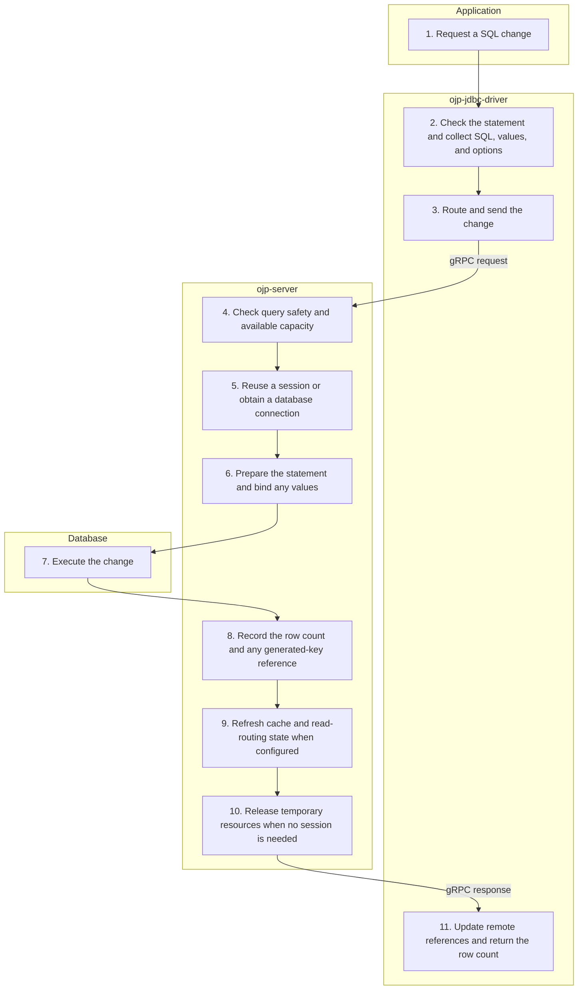

# executeUpdate — Simplified Flow Diagram

An application executes a SQL change through a statement or prepared statement on an open OJP connection. This successful, non-batch path ends with the affected-row count.

## Essential notes

- **2–5:** Client throttling may reject work before sending it. Server checks include circuit breaking and admission capacity. An existing session keeps its connection; generated keys, batching, or session-dependent SQL can require creating a session.
- **6–8:** A retained prepared statement can be reused. Generated keys are fetched separately through [Call Proxy](CALL_PROXY_FLOW.md). Some statement overloads requesting generated keys also use that shared path rather than the dedicated update request shown here.
- **9:** Successful changes invalidate the configured query cache. Read/write splitting marks the session so subsequent reads can stay on the primary database.
- **10:** Without a session, the server closes the temporary statement and returns the borrowed connection to its pool (or closes it in unpooled mode). With a session, resources remain available until separately closed or the session ends.
- **7–11:** In manual-commit mode the row count does **not** mean the transaction is committed; use [commit or rollback](TRANSACTION_FLOW.md).

## Go deeper

- Why might work wait? See [admission and backpressure](../analysis/ADMISSION_CONTROL_BACKPRESSURE_SUMMARY.md).
- How is a manual transaction completed? Follow [commit / rollback](TRANSACTION_FLOW.md), then [connection closure](CLOSE_CONNECTION_FLOW.md).
- Which options change the behaviour? See the [JDBC](../configuration/ojp-jdbc-configuration.md) and [server](../configuration/ojp-server-configuration.md) references.

## Source checkpoints

- [Statement entry and overloads](../../ojp-jdbc-driver/src/main/java/org/openjproxy/jdbc/Statement.java), [prepared updates](../../ojp-jdbc-driver/src/main/java/org/openjproxy/jdbc/PreparedStatement.java), and [routing](../../ojp-jdbc-driver/src/main/java/org/openjproxy/grpc/client/MultinodeStatementService.java).
- [Update execution and cleanup](../../ojp-server/src/main/java/org/openjproxy/grpc/server/action/transaction/ExecuteUpdateAction.java), [admission and safety](../../ojp-server/src/main/java/org/openjproxy/grpc/server/action/transaction/CommandExecutionHelper.java), and [session/connection resolution](../../ojp-server/src/main/java/org/openjproxy/grpc/server/action/streaming/SessionConnectionHelper.java).

See [Simplified Flow Diagrams](MAIN_FLOWS.md) for the conventions and other main flows.
