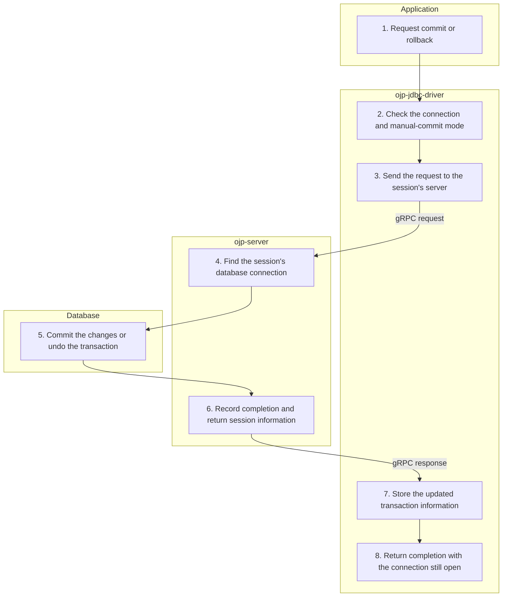

# Commit / rollback — Simplified Flow Diagram

An application completes work on an open, non-XA connection with automatic commit disabled. This successful flow commits or rolls back the transaction while leaving the connection open.

## Essential notes

- **2:** Disabling automatic commit starts a server-side transaction and establishes a session. With automatic commit enabled, the driver's explicit commit/rollback calls do not send these requests.
- **5–8:** Neither operation returns the session's connection to the pool or restores automatic commit. The session and admission permit remain available for further work.
- **5:** Switching automatic commit back on is a [Call Proxy](CALL_PROXY_FLOW.md) operation; the database JDBC driver commits pending work while changing the mode. Rolling back to a savepoint also uses Call Proxy and is distinct from a full rollback.
- **1–8:** Distributed XA transactions use [XA branch work](XA_BRANCH_FLOW.md) and [XA completion](XA_COMPLETION_FLOW.md), not this flow.

## Go deeper

- What happens to resources after completion? Follow [connection closure](CLOSE_CONNECTION_FLOW.md); completing a transaction does not close the logical connection.
- How is isolation handled? See [transaction isolation handling](../analysis/TRANSACTION_ISOLATION_HANDLING.md) and the [JDBC configuration reference](../configuration/ojp-jdbc-configuration.md).
- Who coordinates a distributed transaction? Follow [XA completion](XA_COMPLETION_FLOW.md) instead.

## Source checkpoints

- [Driver transaction and mode changes](../../ojp-jdbc-driver/src/main/java/org/openjproxy/jdbc/Connection.java) and [session-aware routing](../../ojp-jdbc-driver/src/main/java/org/openjproxy/grpc/client/MultinodeStatementService.java).
- [Start transaction](../../ojp-server/src/main/java/org/openjproxy/grpc/server/action/transaction/StartTransactionAction.java), [commit](../../ojp-server/src/main/java/org/openjproxy/grpc/server/action/transaction/CommitTransactionAction.java), and [rollback](../../ojp-server/src/main/java/org/openjproxy/grpc/server/action/transaction/RollbackTransactionAction.java).

See [Simplified Flow Diagrams](MAIN_FLOWS.md) for the conventions and other main flows.
