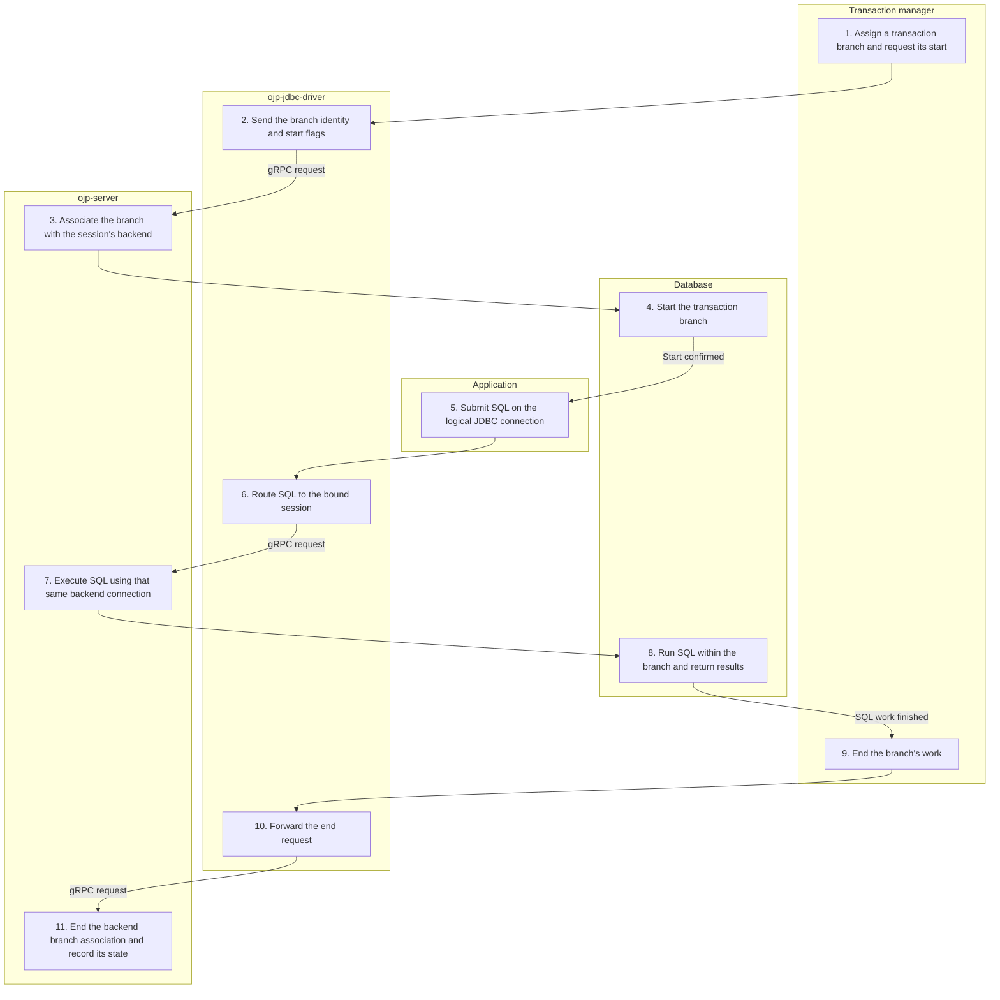

# XA branch work — Simplified Flow Diagram

The transaction manager enlists an established XA session in a transaction branch. This successful path starts the branch, executes application SQL, and ends the branch's work without committing it.

## Essential notes

- **1–4:** The branch identity is an Xid supplied by the transaction manager, not an OJP-generated transaction decision. Pooled mode registers the branch against the backend borrowed during setup.
- **5–8:** Row streaming and affected-row counts follow the [query](EXECUTE_QUERY_FLOW.md) and [update](EXECUTE_UPDATE_FLOW.md) paths, but reuse the XA backend. Session affinity must be preserved; this is not automatic migration of an active branch to another server.
- **9–11:** A successful end does **not** commit. Suspend/resume and join use XA flags on end/start; they are alternatives to the new-branch path shown. Failure flags tell the transaction manager the work did not succeed.
- **11:** Continue with [XA completion](XA_COMPLETION_FLOW.md). Application SQL and transaction-manager calls must follow the XA protocol order.

## Go deeper

- What happens during SQL execution? Follow [executeQuery](EXECUTE_QUERY_FLOW.md) or [executeUpdate](EXECUTE_UPDATE_FLOW.md), keeping the XA assumptions above in mind.
- How is the branch completed? Follow [XA completion](XA_COMPLETION_FLOW.md).
- How does coordination work across databases? See the [XA transaction explanation](../ebook/part3-chapter10-xa-transactions.md).

## Source checkpoints

- [XA requests and flags](../../ojp-jdbc-driver/src/main/java/org/openjproxy/jdbc/xa/OjpXAResource.java) and [session-aware routing](../../ojp-jdbc-driver/src/main/java/org/openjproxy/grpc/client/MultinodeStatementService.java).
- [Start](../../ojp-server/src/main/java/org/openjproxy/grpc/server/action/xa/XaStartAction.java), [end](../../ojp-server/src/main/java/org/openjproxy/grpc/server/action/xa/XaEndAction.java), [SQL connection resolution](../../ojp-server/src/main/java/org/openjproxy/grpc/server/action/streaming/SessionConnectionHelper.java), and [pooled branch tracking](../../ojp-xa-pool-commons/src/main/java/org/openjproxy/xa/pool/XATransactionRegistry.java).

See [Simplified Flow Diagrams](MAIN_FLOWS.md) for the conventions and other main flows.
