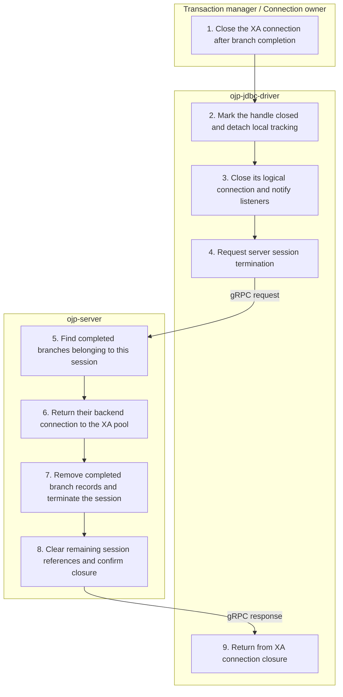

# XA connection closure — Simplified Flow Diagram

After normal pooled branch completion, the transaction manager or connection owner closes the outer XA connection. This successful path returns completed backend work to the XA pool and removes the OJP session.

## Essential notes

- **1–4:** Closing just the logical JDBC connection marks that handle closed; it does **not** terminate the XA session or return the backend. Closing the outer XA connection sends termination synchronously when a session exists.
- **5–7:** Normal pooled return requires both branch completion and outer connection closure. Incomplete branches are not returned by this completed-branch scan; do not use close as a substitute for XA commit/rollback.
- **6–8:** Pooled XA session teardown leaves backend return to the registry rather than closing the physical XA connection directly. Unpooled teardown closes the physical XA connection. The read-only prepare optimization has a separate immediate-return path.
- **1–9:** This diagram assumes a completed, registered branch. Never-used handles, recovery-only sessions, and failure cleanup do not necessarily follow that pool-return path; shared pools and gRPC channels are not shut down.

## Go deeper

- Why are completion and closure both required? See the [dual-condition lifecycle](../multinode/XA_MANAGEMENT.md#dual-condition-session-lifecycle).
- Which settings control the backend pool? See the [JDBC configuration reference](../configuration/ojp-jdbc-configuration.md).
- How does ordinary JDBC closure differ? Compare [connection closure](CLOSE_CONNECTION_FLOW.md).

## Source checkpoints

- [Outer XA connection close](../../ojp-jdbc-driver/src/main/java/org/openjproxy/jdbc/xa/OjpXAConnection.java) and [logical connection close](../../ojp-jdbc-driver/src/main/java/org/openjproxy/jdbc/xa/OjpXALogicalConnection.java).
- [Termination and completed-branch scan](../../ojp-server/src/main/java/org/openjproxy/grpc/server/action/session/TerminateSessionAction.java), [pool return](../../ojp-xa-pool-commons/src/main/java/org/openjproxy/xa/pool/XATransactionRegistry.java), and [session teardown](../../ojp-server/src/main/java/org/openjproxy/grpc/server/Session.java).

See [Simplified Flow Diagrams](MAIN_FLOWS.md) for the conventions and other main flows.
