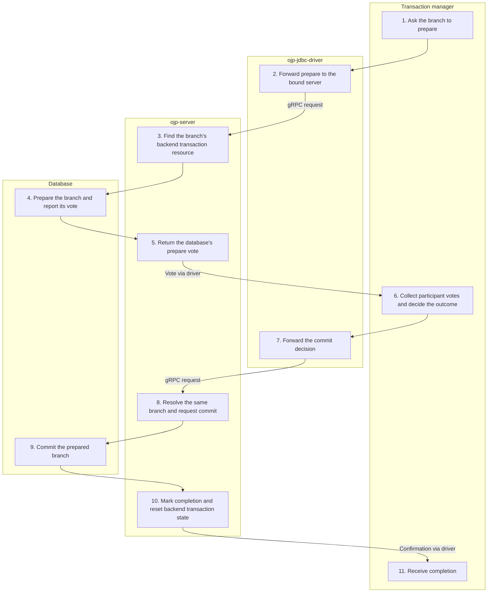

# XA prepare / commit / rollback — Simplified Flow Diagram

After branch work ends, the transaction manager coordinates completion. This successful two-phase commit path shows one OJP participant; the transaction manager coordinates the other participants outside OJP.

## Essential notes

- **4–6:** A prepared vote keeps the branch pending until the coordinator's decision. A read-only vote needs no second phase; the pooled registry immediately completes and releases that branch's backend.
- **5:** OJP forwards prepare to the database; it does not write a durable XA transaction log. Pooled mode only updates the branch's in-memory state to prepared for lifecycle tracking. The database owns durable prepared state; the transaction manager owns the global decision.
- **6–9:** For rollback, the coordinator sends rollback instead of commit and the database undoes the branch. Rollback can also occur without prepare. One-phase commit skips steps 1–5 and sends commit with the one-phase flag after branch work ends.
- **10–11:** Normal pooled commit/rollback marks the branch complete and sanitizes its backend, but keeps it attached until [XA connection closure](XA_CLOSE_FLOW.md). Completion is not itself pool return.
- **1–11:** OJP relays participant operations; it does not choose the global outcome. Failures and in-doubt branches require coordinator handling and [recovery](XA_RECOVERY_FLOW.md), not an assumption that all participants committed.

## Go deeper

- When does the pooled backend return? Follow [XA connection closure](XA_CLOSE_FLOW.md) and the [dual-condition lifecycle](../multinode/XA_MANAGEMENT.md#dual-condition-session-lifecycle).
- What if the outcome is in doubt? Follow [XA recovery](XA_RECOVERY_FLOW.md) and read the [guarantees and limitations](../ebook/part3-chapter10-xa-transactions.md#109-xa-guarantees-and-limitations-what-ojp-can-and-cannot-promise).
- How does ordinary JDBC differ? Compare [commit / rollback](TRANSACTION_FLOW.md).

## Source checkpoints

- [Driver XA operations](../../ojp-jdbc-driver/src/main/java/org/openjproxy/jdbc/xa/OjpXAResource.java), [prepare](../../ojp-server/src/main/java/org/openjproxy/grpc/server/action/xa/XaPrepareAction.java), [commit](../../ojp-server/src/main/java/org/openjproxy/grpc/server/action/xa/XaCommitAction.java), and [rollback](../../ojp-server/src/main/java/org/openjproxy/grpc/server/action/xa/XaRollbackAction.java).
- [Votes, branch state, and backend sanitization](../../ojp-xa-pool-commons/src/main/java/org/openjproxy/xa/pool/XATransactionRegistry.java).

See [Simplified Flow Diagrams](MAIN_FLOWS.md) for the conventions and other main flows.
