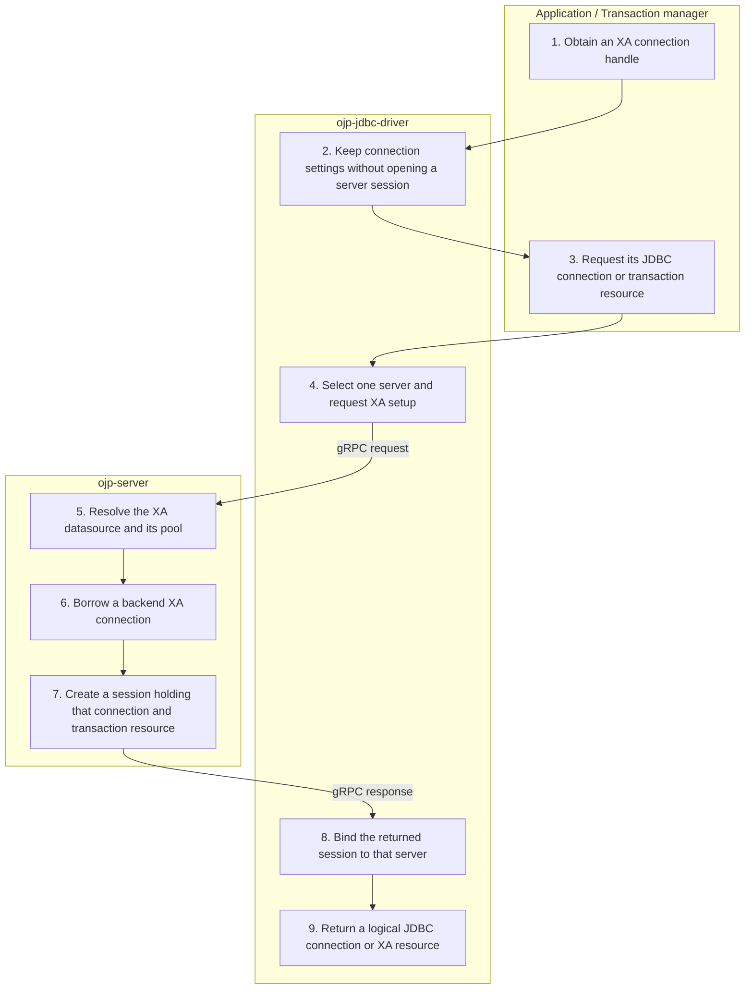

# XA connection setup — Simplified Flow Diagram

An application or transaction manager obtains an XA connection and requests its JDBC connection or XA resource. This successful pooled path ends with a server-bound XA session ready for enlistment.

## Essential notes

- **2–4:** Both the JDBC connection and XA resource share the same session. Asking for either can trigger setup; creating the outer XA handle alone does not.
- **4–8:** XA setup selects one server, unlike regular first-time connect across endpoints. The borrowed backend is pinned to this session; it is already borrowed before the first transaction starts.
- **5–7:** XA pooling uses the XA pool provider, not the regular JDBC pool. In unpooled mode setup records an XA datasource without creating a session; the backend connection is opened on demand.
- **9:** The transaction manager controls commit and rollback through the XA resource. The logical JDBC connection rejects direct commit/rollback. Continue with [XA branch work](XA_BRANCH_FLOW.md).

## Go deeper

- How do I configure an XA datasource? See [XA management](../multinode/XA_MANAGEMENT.md#configuration) and the [JDBC configuration reference](../configuration/ojp-jdbc-configuration.md).
- What happens after setup? Follow [XA branch work](XA_BRANCH_FLOW.md).
- How does ordinary JDBC differ? Compare [Connect](CONNECT_FLOW.md).

## Source checkpoints

- [XA datasource](../../ojp-jdbc-driver/src/main/java/org/openjproxy/jdbc/xa/OjpXADataSource.java), [lazy session creation](../../ojp-jdbc-driver/src/main/java/org/openjproxy/jdbc/xa/OjpXAConnection.java), and [single-server selection](../../ojp-jdbc-driver/src/main/java/org/openjproxy/grpc/client/MultinodeConnectionManager.java).
- [Pooled setup](../../ojp-server/src/main/java/org/openjproxy/grpc/server/action/connection/HandleXAConnectionWithPoolingAction.java), [unpooled setup](../../ojp-server/src/main/java/org/openjproxy/grpc/server/action/connection/HandleUnpooledXAConnectionAction.java), and [logical connection rules](../../ojp-jdbc-driver/src/main/java/org/openjproxy/jdbc/xa/OjpXALogicalConnection.java).

See [Simplified Flow Diagrams](MAIN_FLOWS.md) for the conventions and other main flows.
