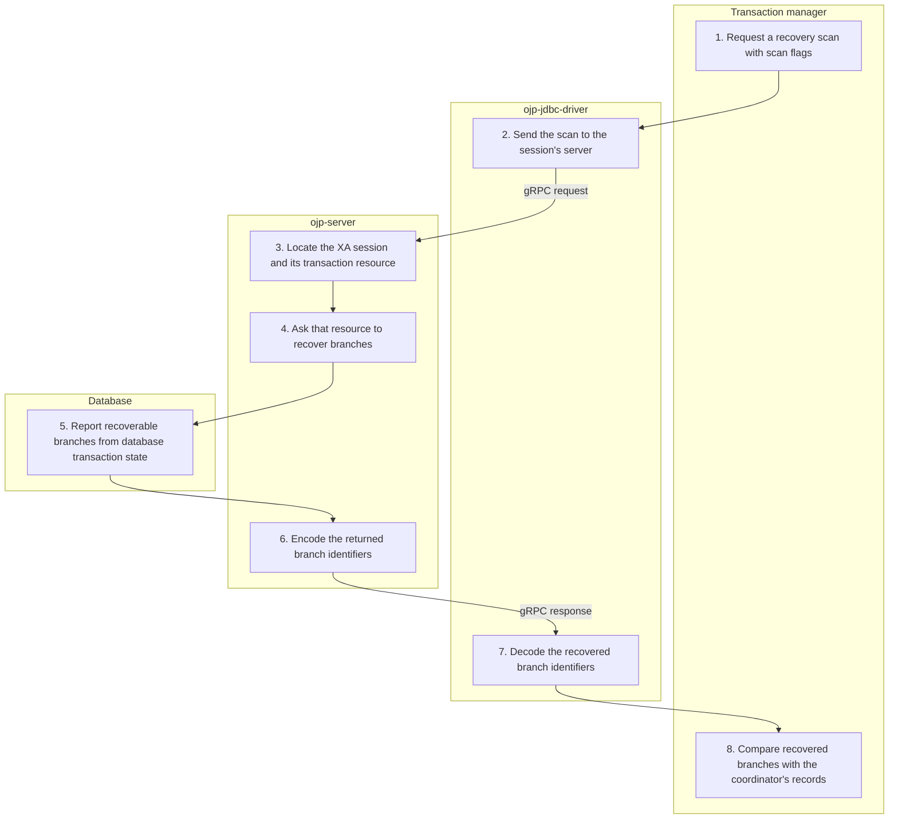

# XA recovery scan — Simplified Flow Diagram

A transaction manager asks an established XA session for recoverable branch identifiers. This scan ends when those identifiers are returned; deciding and completing their outcome is separate.

## Essential notes

- **1–4:** First obtain an XA resource through [XA setup](XA_CONNECT_FLOW.md). The scan uses that session's existing backend resource, not a fresh pool borrow for each scan. Start/end scan flags are passed through.
- **5–8:** Recovery reads database state, not just OJP's in-memory branch registry. It does not commit or roll back anything; the transaction manager owns the decision.
- **8:** Do not infer automatic restart recovery from this scan: pooled commit/rollback currently requires the branch in OJP's in-memory registry. Returning an Xid alone does not recreate a lost registry entry or migrate an active branch.
- **2–8:** The driver reports transient unreachable-server/timeout scan failures as retryable resource-manager failures. A coordinator may separately request forget for heuristic outcomes; that call delegates to the backend resource, not a normal commit or pool cleanup.

## Go deeper

- What can OJP promise during recovery? Read the [XA guarantees and limitations](../ebook/part3-chapter10-xa-transactions.md#109-xa-guarantees-and-limitations-what-ojp-can-and-cannot-promise).
- How does normal completion work? Follow [XA completion](XA_COMPLETION_FLOW.md).
- What should operators inspect? See [XA troubleshooting](../multinode/XA_MANAGEMENT.md#troubleshooting).

## Source checkpoints

- [Scan flags, Xid decoding, and transient errors](../../ojp-jdbc-driver/src/main/java/org/openjproxy/jdbc/xa/OjpXAResource.java) and [bound-server routing](../../ojp-jdbc-driver/src/main/java/org/openjproxy/grpc/client/MultinodeStatementService.java).
- [Backend recovery scan](../../ojp-server/src/main/java/org/openjproxy/grpc/server/action/xa/XaRecoverAction.java), [pooled completion lookup](../../ojp-xa-pool-commons/src/main/java/org/openjproxy/xa/pool/XATransactionRegistry.java), and [forget delegation](../../ojp-server/src/main/java/org/openjproxy/grpc/server/action/transaction/XaForgetAction.java).

See [Simplified Flow Diagrams](MAIN_FLOWS.md) for the conventions and other main flows.
